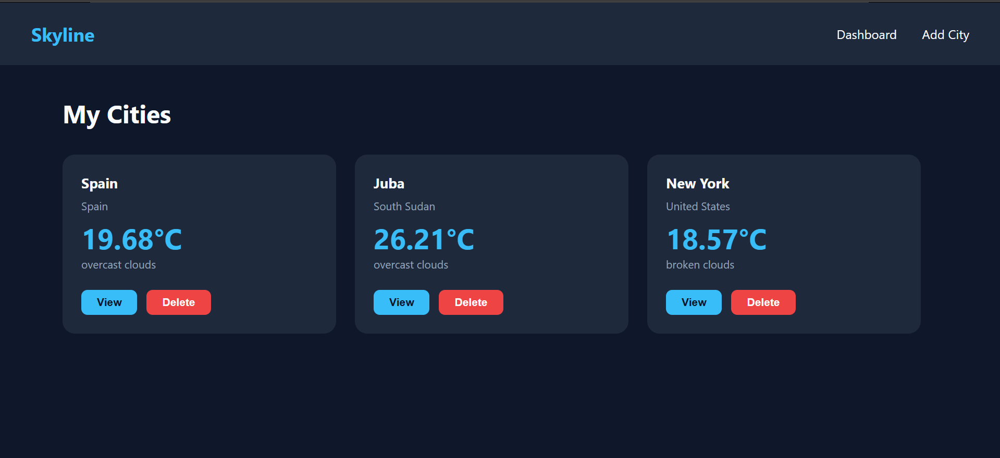
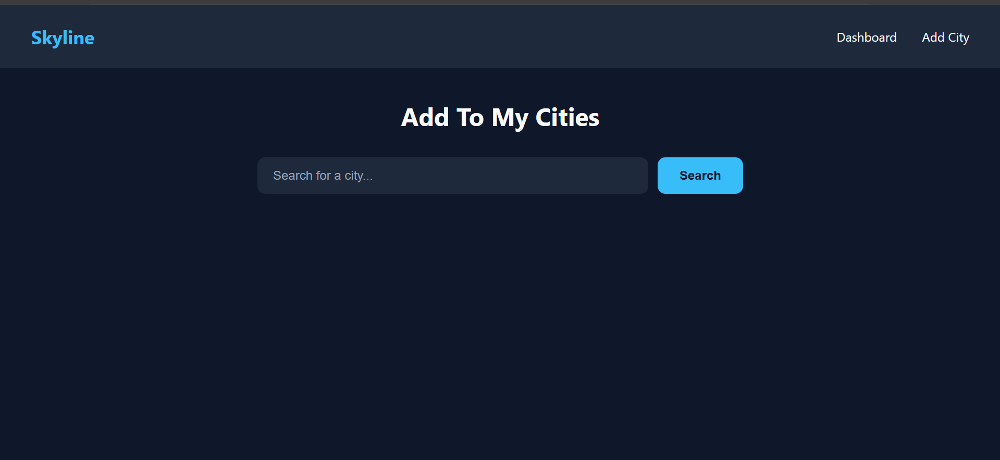
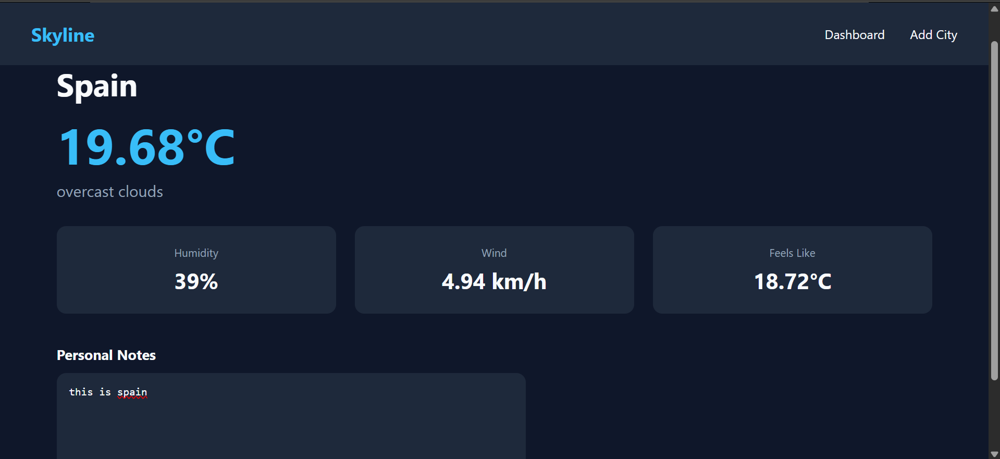

# Skyline 🌤️

A personal weather dashboard to save and track cities with live weather conditions.

## Live Demo

🔗 [https://skyline-weather-app-topaz.vercel.app/](https://skyline-weather-app-topaz.vercel.app/)

## Screenshots

### Dashboard



### Add City



### City Detail



## Features

- Search and save cities to your personal dashboard
- View live weather conditions, temperature, humidity, wind speed and feels like
- Add personal notes to each city
- Delete cities from your dashboard
- Responsive design — works on desktop and mobile

## Tech Stack

- React.js
- React Router
- json-server
- OpenWeatherMap API
- Vercel (deployment)

## Setup

1. Clone the repo

```bash
   git clone https://github.com/OmanDavid/skyline-weather-app.git

```

2. Install dependencies

```bash
   npm install

```

3. Create a `.env` file in the root and add your OpenWeatherMap API key:

4. Start json-server

```bash
   json-server --watch db.json --port 5000
```

5. Start the app

```bash
   npm start
```

## Team

- Oman David
- Lary Thuku
- Nungari Muchiru
- Robert Kiprop
